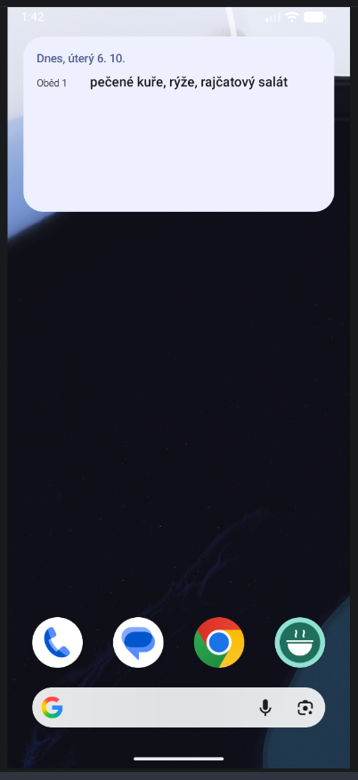
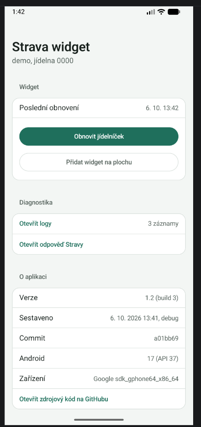

# strava.cz_widget

Widget na plochu Androidu pro [strava.cz](https://www.strava.cz). Ukáže všechno, co máš na dnešek objednané: snídani, polévku, oběd i večeři. Po 21:00 a o víkendu přepne na nejbližší další den.

  
  

## Instalace

1. Stáhni soubor `.apk` z [Releases](../../releases/latest) a otevři ho v telefonu (Android 8 nebo novější). Android se zeptá na povolení instalace z neznámého zdroje.
2. Otevři aplikaci a přihlas se číslem jídelny, jménem a heslem ze strava.cz.
3. Klepni na **Přidat widget na plochu**.
